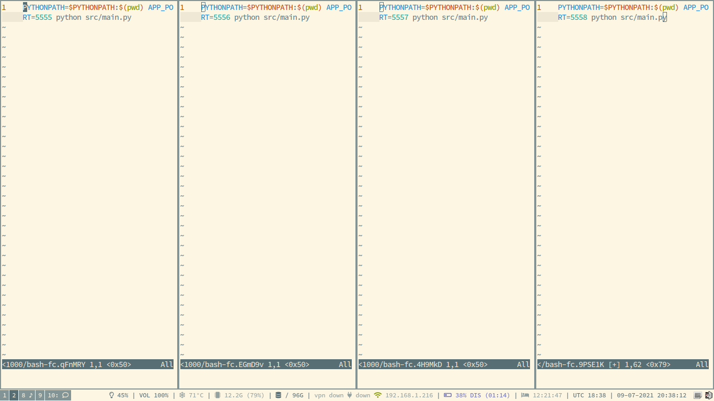

# Assignment 1 report - Olgierd Kasprowicz

## SBB completion

Working commit hash: `94a4f22bff3cfd7395fc15eddf8f043690d8b9e7`

## Blocktime calculations

<!--TODO: ułożyć-->
Document the struggle
target - 200s

2 zeros -> 2.5s
3 zeros -> 9.505s
4 zeros -> 87.612s
5 zeros -> 1653.360s

0.5% error because of the measuring interval

Conclusion -> 4 zeros
